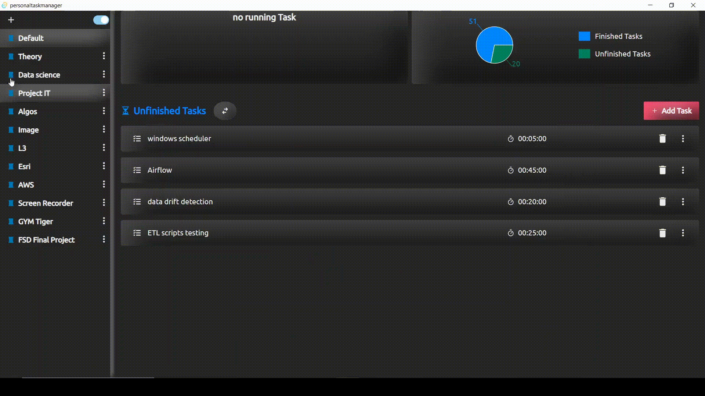
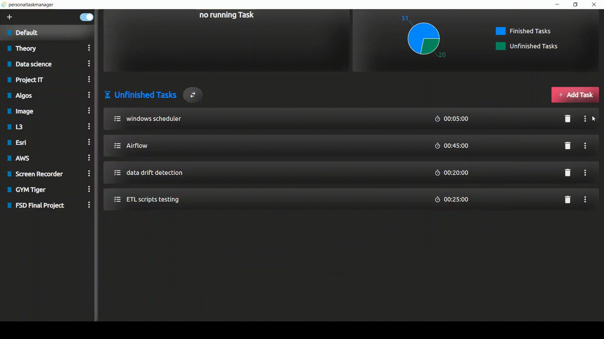
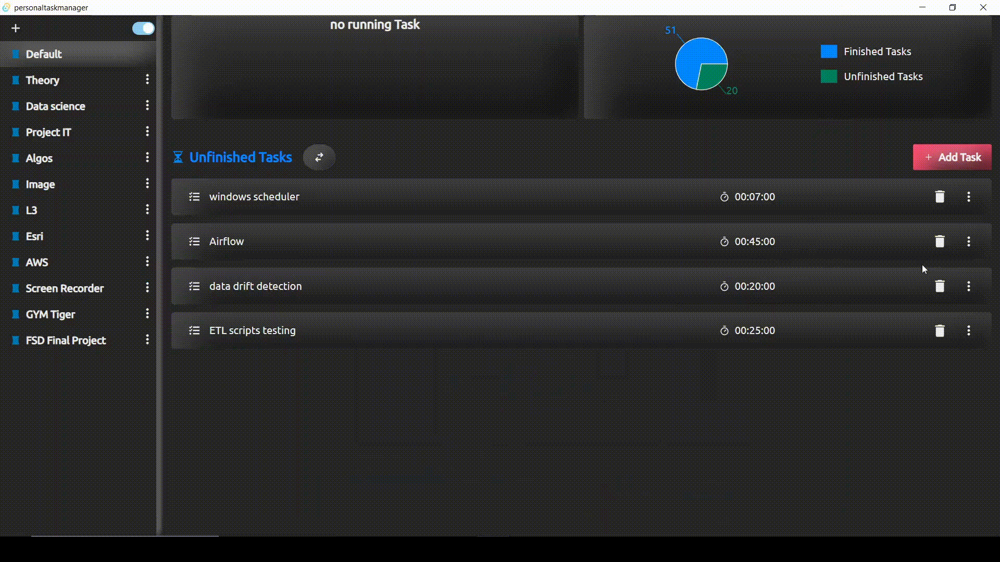
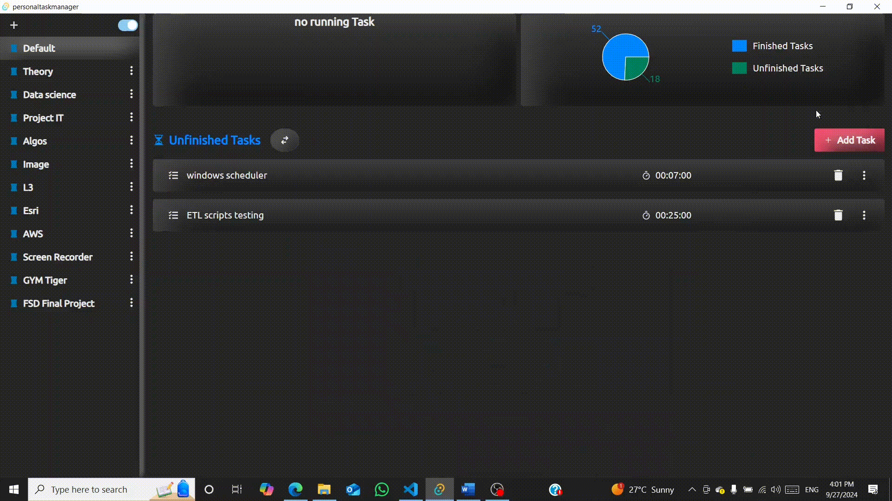
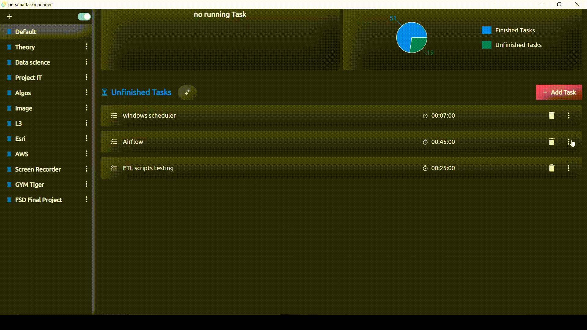
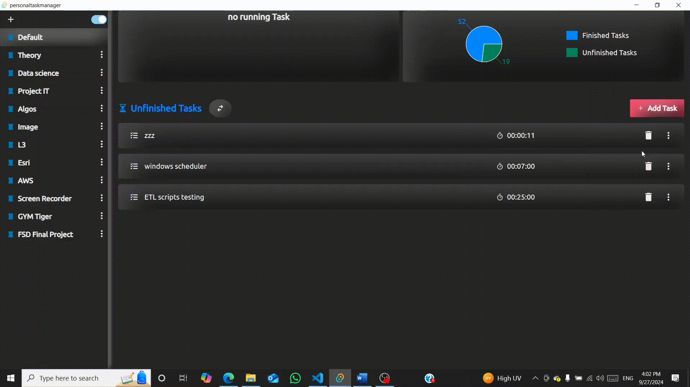

# Personal Task Manager

#### A desktop app designed to facilitate managing personal tasks.

The app was built using the Tauri framework (Rust for the backend and React for the frontend).

## Main Features

- Adding tasks based on categories
- Editing and Removing tasks
- Assign a duration for each task
- Create multiple categories
- Automatic software update functionality. Users are notified of updates through in-app dialogs, ensuring they have access to the latest version.

## Stacks

#### <u>Frontend</u>

- TypeScript
- React
- ChakraUI
- Redux

#### <u>Backend</u>

- Rust
- SQLite

## Implementation

| Overview                       | Edit Task                  |
| ------------------------------ | -------------------------- |
|  |  |

| Delete Task                  | Add Task                  |
| ---------------------------- | ------------------------- |
|  |  |

| Change Task Status                | Start Task                  |
| --------------------------------- | --------------------------- |
|  |  |

  

> _You can download the app and try it from the releases._
